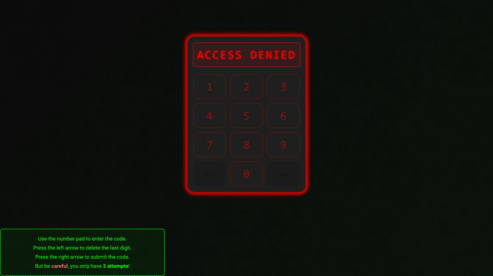
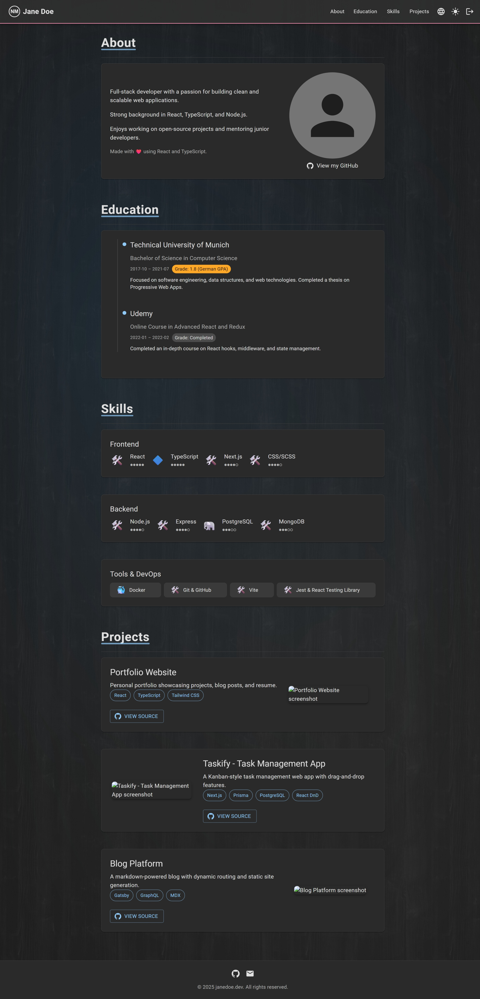

# website-backend

This application serves as the backend for a personal website, providing a REST API to manage content and user authentication. It is built using Spring Boot and uses Docker Compose for deployment. The backend is designed to work seamlessly with a frontend application built using React, which can be found at https://github.com/nimazzo/website-frontend. The website is designed to require authentication to be accessed, using a simple token-based system, where users can log in with a predefined token or an admin can create new tokens. The application also includes a simple brute-force defender that blocks IP addresses after too many failed login attempts.

## Table of Contents

- [Requirements](#requirements)
- [Setup](#setup)
- [Usage](#usage)
- [Screenshots](#screenshots)

## Requirements

In order to run the application, you need to have the following installed:

- JDK 24
- Docker (Including Docker Compose)

## Setup

To build and run this application, follow these steps:

### Clone the repository

```sh
$ git clone https://github.com/nimazzo/website-backend.git
$ cd website-backend
```

### Set up Environment Variables

+ `CONTENT_PATH`: Path where the content of the website will be uploaded to.
+ `SECURITY_BRUTEFORCE_DEFENDER_BLOCK_TIME`: Time for which an IP address will be blocked after too many
  failed login attempts.
+ `SECURITY_CREATE_PUBLIC_TOKEN`: If set to `true`, a public token (`00000000`) will be created on application startup.
+ `SECURITY_ADMIN_PASSWORD`: Password for the admin user. If not set, a random password will be generated and printed
  to the console on application startup.
+ `PGADMIN_EMAIL`: Email address for the pgAdmin user.
+ `PGADMIN_PASSWORD`: Password for the pgAdmin user.
+ `SPRING_DATASOURCE_URL`: JDBC URL for the PostgreSQL database.
+ `PG_DB`: Name of the PostgreSQL database.
+ `PG_USER`: Username for the PostgreSQL database.
+ `PG_PW`: Password for the PostgreSQL database.

You can set these environment variables in your terminal or create a `.env` file in the root directory of the project.

#### Example .env file:

```dotenv
# Application configuration
CONTENT_PATH=./content
SECURITY_BRUTEFORCE_DEFENDER_BLOCK_TIME=10m
SECURITY_CREATE_PUBLIC_TOKEN=false
SECURITY_ADMIN_PASSWORD=secret

# PgAdmin configuration
PGADMIN_EMAIL=admin@example.com
PGADMIN_PASSWORD=secret

# PostgreSQL configuration
SPRING_DATASOURCE_URL=jdbc:postgresql://postgres:5432/development
PG_DB=development

PG_USER=user
PG_PW=secret
```

### Docker Compose Setup

Ensure you have Docker and Docker Compose installed and your Docker daemon is running. The project includes a `compose.yml` file for production use and a
`compose-dev.yml` file for development use. The `compose.yml` file includes the Spring Boot server as a service, while the
`compose-dev.yml` file does not.

To run the app completely within Docker, run:
```sh
$ docker compose up -d --build
```

If you want to run the Spring Boot server outside of Docker, make sure to enable the `dev` profile so that the correct `compose-dev.yml` file is used by Spring Boot's Docker Compose Support.
```sh
$ ./mvnw spring-boot:run -Dspring-boot.run.profiles=dev
```

## Usage

Once the server is running, the website will be served at `http://localhost:8080`. By default, unauthenticated users will be redirected to a [lockscreen](#Lockscreen). This can be skipped by passing the authentication token as a query parameter, e.g. `http://localhost:8080/authenticate?code=00000000`.

### Web Interface

The users of the website interact with the application solely through the provided web interface. The user can simply visit the website at `http://localhost:8080` and will be redirected to the [lockscreen](#lockscreen) or the actual [homepage](#homepage) depending on whether they are authenticated or not. Administration tasks have to be done through the provided [REST API](#admin-rest-api).

### Admin REST API
+ All endpoints require valid administration credentials to be supplied using HTTP Basic Authentication.

#### Creating Login Tokens
+ `PUT /admin/tokens`
+ Pass the data in the request body as JSON.
```json
{
  "token": "12345678",
  "owner": "Bob"
}
```

#### Retrieving Login Tokens
+ `GET /admin/tokens`
+ Returns a list of all registered login tokens in the database.

#### Unblocking Users
+ `POST /admin/unblock`
+ Deletes all entries of failed login attempts from the database and thus unblocks all users that were blocked due to too many failed login attempts.

#### Uploading Content
+ `POST /admin/content`
+ Pass the content of the website bundled as a ZIP file in the request body as `multipart/form-data` with the key `content`.
+ The ZIP file should meet the following structure:
```text
.
├── content_de.json
├── content_en.json
└── private
    └── content
        ├── file_1
        ├── file_2
        ├── <...>
        └── file_n
```
  - `content_de`: German translation of the website's content.
  - `content_en`: English translation of the website's content.
  - `private/content/<file>`: Other files such as images, that are meant to be displayed on the website. The name (e.g. `private/content/file1`) of these files can be referenced in the `content_de.json` and `content_en.json` files.

The `content_xx.json` files must contain the following fields:
```typescript
interface ContentData {
  about: {
    name: string;
    domain: string;
    description: string[];
    photo: string | null;
    country: string;
    github: {
      text: string;
      url: string;
    }
    email: string;
    footer: string;
  }
  education: {
    institution: string;
    degree: string;
    field: string;
    startDate: string;
    endDate: string;
    description: string;
    grade: string,
    icon: string,
  }[]
  skills: {
    title: string;
    withLevels: boolean;
    items: { name: string, level?: number }[];
  }[]
  projects: {
    title: string;
    description: string;
    techStack: string[];
    screenshotUrl: string | null;
    githubUrl: string;
  }[]
}
```

### Actuator Endpoints
By default, the following actuator endpoints are enabled:
+ `/actuator/health`
+ `/actuator/metrics`
+ `/actuator/loggers`

## Screenshots
### Lockscreen

### Blocked after 3 failed login attempts

### Homepage

